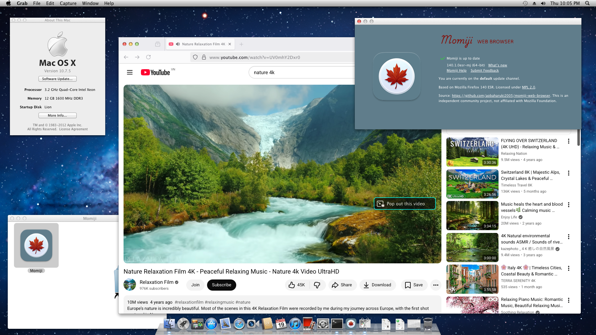

# Momiji Web Browser - macOS Legacy (10.7-10.14) support

## About Momiji

Custom Firefox browser backported and maintained for macOS 10.7-10.14.

This project is the successor and inheritance of [firefox-dynasty](https://github.com/i3roly/firefox-dynasty) project - which (together with the owner), unfortunately, has been taken down due to GitHub violation of Term of Use. You can find more detail about the incident in this [MacRumors post](https://forums.macrumors.com/threads/firefox-dynasty-firefox-for-os-x-10-8-also-web-app-templates.2446475/post-34441749).

Momiji（紅葉、もみじ）means "red leaves of autumn" in Japanese. I came up with the idea because the Japanese "mo" sound resembles the "mo" sound in the original "Mozilla Foundation" trademark. Additionally, red leaves are also told to be able to make people remind of good old memories, so using such a name for this backported Firefox distribution, to my thought, is a good idea (maybe).

## Features:
- Allow browsing modern Web and using up-to-date Web services securely (with fully applied security patches) on macOS version unsupported by Apple and Mozilla, with almost fully working functions (for more detail about poorly supported Web functions, especially if you are using macOS 10.7, please check out for "Known caveats" subsection)
- Disable unnecessary and unsupported components: Crash Reporter, WebAssembly, Tests, Debug, Dark Matter Detector (DMD), Geckodriver and Profiling.

## Known caveats
- **(FIXED in 2026-Mar-20)** My self-designed Momiji icon logo for Momiji is broken in Finder's List view mode (especiall on macOS 10.10 and up). In other modes, however, the logo icon is still displaying fine. 
- Some special functions like live-streaming, online meeting and graphics design (Canva, Adobe Cloud Creative, ...) may not work smoothly or functionally as expected on very old macOS version (due to insufficient of proper Mac machine for unit testing, I haven't been able to carry out intensive test and make comprehensive judgements)
- **For 10.7 users:** 
    - Hardware-accelerated rendering is completely unavailable, only software rendering is usable.
    - On macOS 10.8 and later, `CoreText.framework` is located at `/System/Library/Frameworks`. However, in macOS 10.7 and earlier, Apple stored it as a stub at `/System/Library/Frameworks/ApplicationServices.framework/Versions/A` (Hey Apple, what the logic are you implying here?). To fix this path difference, before running Momiji on your 10.7 for the first time, REMEMBER to run this command first:

    `sudo ln -s /System/Library/Frameworks/ApplicationServices.framework/Versions/A/Frameworks/CoreText.framework /System/Library/Frameworks/CoreText.framework`

    This command will trick Momiji to think that macOS 10.7 "really" locates `CoreText.framework` at `/System/Library/Frameworks` and continues to execute as usual.

- **For 10.8 users:** hardware acceleration is available but stills buggy (on my Ivy Bridge machine, fonts look partially broken). In case of bug experience, follow [this guide](https://support.mozilla.org/en-US/kb/performance-settings) to turn off hardware acceleration for better Web experience.

## Modifications

Here is a summary of modifications I have made to produce macOS 10.7-10.14-compatible Firefox distributions:
- Rust compiler patches (deployment target)
- Standard library patches (API compatibility)
- Build system modifications (framework linking)

See [CHANGES.md](CHANGES.md) for complete list. (As of latest commit in 2026-Mar-19, documenting work is still in progress).

## License and Trademarks

Momiji is licensed under the [Mozilla Public License 2.0](LICENSE)

Firefox® is a registered trademark of the Mozilla Foundation.
This project is NOT AFFILIATED WITH, ENDORSED BY, OR SPONSORED by Mozilla Foundation.

## Disclaimer
This is an independent community open-source project. Use at your own risk. No warranty provided.

## Source Code
Full source code is available in this repository, as required by the Mozilla Public License 2.0.

Modified files are documented in [CHANGES.md](CHANGES.md).

## Downloads
Check out for my releases (binary distribution and source code archive) in this [Releases](https://github.com/aobaharuki2005/firefox-dynasty-RELIFE/releases) page.

## Credits

If I've forgotten to put your name here, please let me know and I'll add it.

[Mozilla Developers](https://github.com/mozilla-firefox) - Firefox browser base

[i3roly](https://github.com/i3roly) - Original ideas, patches and owners of firefox-dynasty project

[Wowfunhappy](https://github.com/Wowfunhappy) - Maintainers of the firefox-dynasty fork of the original project. Without his invaluable forked source, I wouldn't have been able to rebuilt, reverse engineered and revive the project from scratch like today.

## Contact

In case of any questions, please contact me via email: tranbaohnth@outlook.com.vn

# Original repository readme

[Firefox](https://firefox.com/) is a fast, reliable and private web browser from the non-profit [Mozilla organization](https://mozilla.org/).

## Contributing

To learn how to contribute to Firefox read the [Firefox Contributors' Quick Reference document](https://firefox-source-docs.mozilla.org/contributing/contribution_quickref.html).

We use [bugzilla.mozilla.org](https://bugzilla.mozilla.org/) as our issue tracker, please file bugs there.

## Resources

* [Firefox Source Docs](https://firefox-source-docs.mozilla.org/) is our primary documentation repository
* Nightly development builds can be downloaded from [Firefox Nightly page](https://www.mozilla.org/firefox/channel/desktop/#nightly)

If you have a question about developing Firefox, and can't find the solution
on [Firefox Source Docs](https://firefox-source-docs.mozilla.org/), you can try asking your question on Matrix at
chat.mozilla.org in the [Introduction channel](https://chat.mozilla.org/#/room/#introduction:mozilla.org).
