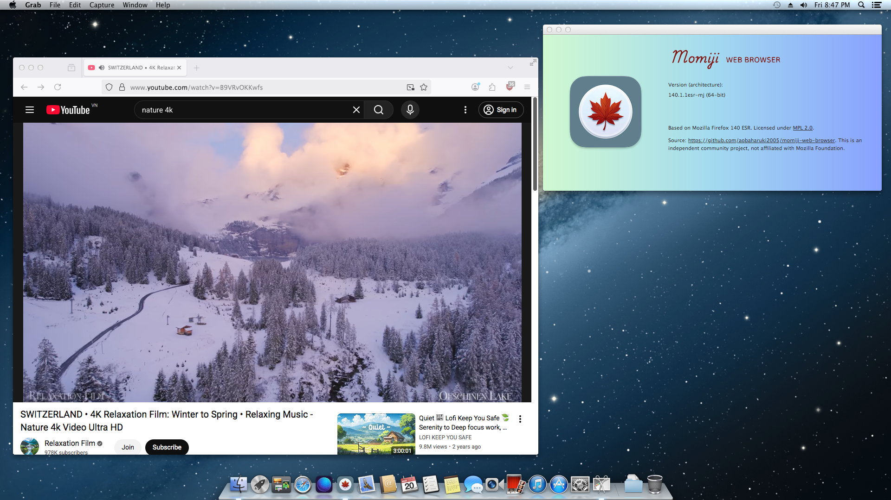

**If you are not Vietnamese speakers, please read the English edition in [this link](README.en.md)**

# Trình duyệt web Momiji - hỗ trợ đối với macOS phiên bản cũ (10.7-10.14)

## Về Momiji

Đây là trình duyệt Firefox tuỳ chỉnh được xây dựng tương thích ngược và duy trì dành cho macOS phiên bản 10.7-10.14.

Dự án này là sự kế thừa và tiếp tục của dự án [firefox-dynasty](https://github.com/i3roly/firefox-dynasty) - thật không may, dự án này (cùng với chủ sở hữu của nó) đã bị gỡ bỏ do vi phạm các điều khoản sử dụng của GitHub. Bạn có thể tìm hiểu về chi tiết sự việc trong [bài viết sau trên diễn đàn MacRumors](https://forums.macrumors.com/threads/firefox-dynasty-firefox-for-os-x-10-8-also-web-app-templates.2446475/post-34441749) (bài viết tiếng Anh).

Momiji （紅葉、もみじ）- nghĩa là "lá đỏ mùa thu" trong tiếng Nhật. Ý tưởng này bắt nguồn từ sự tương đồng giữa âm tiếng Nhật "mo" và âm "mo" trong thương hiệu gốc "Quỹ Mozilla" (Mozilla Foundation). Bên cạnh đó, chiếc lá đỏ thường được nhắc đến như là 1 hình ảnh gợi con người nhớ lại những ký ức, kỉ niệm đẹp đã qua; do đó, tôi nghĩ rằng việc đặt tên này cho một bản tuỳ chỉnh của Firefox chạy trên nền tảng cũ (macOS 10.7-10.14) là một ý tưởng hay (có lẽ vậy).

## Tính năng
- Cho phép truy cập Web hiện đại và sử dụng các dịch vụ Web tiên tiến một cách an toàn (với các bản vá bảo mật đã được cập nhật đầy đủ) trên các phiên bản macOS không còn được Apple và Mozilla chính thức hỗ trợ với gần như đầy đủ các tính năng (chi tiết những tính năng không được hỗ trợ đầy đủ, vui lòng đọc phần Hạn chế)
- Lược bỏ những thành phần không cần thiết và không được hỗ trợ: Crash Reporter (trình báo lỗi), WebAssembly, Tests (bộ kiểm thử), Debug (bộ gỡ lỗi), Dark Matter Detector (công cụ theo dõi rò rỉ bộ nhớ), Geckodriver (điều khiển trình duyệt tự động), Profiling (công cụ đo đạc hiệu năng)

## Hạn chế
- **(ĐÃ FIX ngày 20/03/2026)** Icon logo do tôi tự thiết kế cho Momiji bị vỡ và nhoè trong chế độ hiển thị Danh sách (List) của Finder (đặc biệt là macOS 10.10 trở lên). Tuy nhiên trong các chế độ khác thì icon vẫn hiển thị bình thường.
- Một số chức năng đặc thù như live-streaming, họp trực tuyến hoặc thiết kế đồ hoạ (Canva, Adobe Cloud Creative, ...) có thể không hoạt động mượt mà hoặc đầy đủ tính năng như kì vọng trên các phiên bản macOS rất cũ (vì sự thiếu hụt máy tính Mac phù hợp nên tôi chưa thể kiểm thử và đưa ra đánh giá đầy đủ)
- **Với người dùng macOS 10.7**: 
    - Tăng tốc đồ hoạ bằng phần cứng hoàn toàn không được hỗ trợ. Hiện tại chỉ có thể kết xuất hiển thị đồ hoạ Web bằng phần mềm (sẽ chậm hơn đáng kể so với tăng tốc đồ hoạ bằng phần cứng)
    - Trên macOS 10.8 trở về sau, `CoreText.framework` nằm ở `/System/Library/Frameworks`. Tuy nhiên, trong macOS 10.7 trở về trước, Apple lại lồng nó bên trong `ApplicationServices.framework`, cụ thể: `/System/Library/Frameworks/ApplicationServices.framework/Versions/A` (Apple đang ám chỉ điều gì ở đây vậy?). Để khắc phục sự khác biệt về đường dẫn này, trước khi chạy Momiji trên macOS 10.7 của bạn lần đầu tiên, HÃY NHỚ chạy lệnh này đầu tiên:

    `sudo ln -s /System/Library/Frameworks/ApplicationServices.framework/Versions/A/Frameworks/CoreText.framework /System/Library/Frameworks/CoreText.framework`

    Lệnh này sẽ đánh lừa Momiji rằng macOS 10.7 "thực sự có" `CoreText.framework` tại `/System/Library/Frameworks` và tiếp tục chạy như bình thuờng.

- **Với người dùng macOS 10.8**: tăng tốc đồ hoạ được hỗ trợ một phần, nhưng còn nhiều lỗi (trên máy tính vi xử lý Ivy Bridge thế hệ thứ 3 của tôi, font chữ thường xuyên bị "vỡ"). Trong trường hợp gặp lỗi hiển thị font/hình ảnh, hãy làm theo [hướng dẫn này](https://support.mozilla.org/en-US/kb/performance-settings) để tắt tăng tốc đồ hoạ bằng phần cứng để có trải nghiệm duyệt Web tốt hơn.

## Các thay đổi

Dưới đây là tóm tắt những thay đổi tôi đã thực hiện với mã nguồn để xuất ra được phiên bản Firefox chạy được trên macOS 10.7-10.14:
- Các bản vá với trình biên dịch Rust (về mặt Nền tảng triển khai đích - deployment target)
- Các bản vá với thư viện chuẩn (về mặt tương thích Giao diện lập trình ứng dụng - API compatibility)
- Các thay đổi đối với cấu hình hệ thống biên dịch (về mặt liên kết macOS Framewrork - Framework linking)

Chi tiết các thay đổi được đề cập trong file [CHANGES.md](CHANGES.md) (tiếng Anh). (Tính tới commit mới nhất vào ngày 19/03/2026, việc tài liệu hoá vẫn đang được tiếp tục tiến hành.)

## Giấy phép và Thương hiệu

Momiji tuân thủ Giấy phép Công cộng Mozilla 2.0 [(Mozilla Public License 2.0)](LICENSE)

Firefox® là thương hiệu đã được đăng kí bảo hộ và thuộc quyền sở hữu của Quỹ Mozilla.
Dự án này KHÔNG LIÊN KẾT VỚI, KHÔNG ĐƯỢC HỖ TRỢ CÔNG KHAI VÀ KHÔNG ĐƯỢC TÀI TRỢ bởi Quỹ Mozilla.

## Tuyên bố Miễn trừ trách nhiệm

Đây là một dự án mã nguồn mở cộng đồng độc lập. Người dùng tự chịu trách nhiệm cho mọi rủi ro khi cài đặt, sử dụng và tự biên dịch phần mềm mà không có bất kì sự đảm bảo bổ sung nào.

## Về Mã nguồn

Mã nguồn chi tiết được lưu trữ trong kho lưu trữ (repository) này, như được yêu cầu bởi Giấy phép Công cộng Mozilla 2.0.

Danh sách những file đã được chỉnh sửa được tài liệu hoá chi tiết trong file [CHANGES.md](CHANGES.md).

## Tải về

Để tải về các phiên bản chính thức, vui lòng truy cập trang [Releases](https://github.com/aobaharuki2005/firefox-dynasty-RELIFE/releases) (Xuất bản) của dự án.

## Lời cảm ơn

Xin chân thành gửi lời cảm ơn tới:

[Các nhà phát triển Mozilla](https://github.com/mozilla-firefox) - cộng đồng tác giả mã nguồn gốc của Firefox

[i3roly](https://github.com/i3roly) - ý tưởng, các bản vá ban đầu và chủ sở hữu dự án firefox-dynasty gốc (tài khoản đã bị xoá)

[Wowfunhappy](https://github.com/Wowfunhappy) - người duy trì bản sao (fork) của dự án firefox-dynasty gốc. Không có bản sao mã nguồn quý giá này, tôi đã không thể tái biên dịch, phân tích phiên mã ngược (reverse engineering) và hồi sinh được dự án từ con số 0 như ngày hôm nay.

## Liên hệ

Trong trường hợp có bất kì câu hỏi nào, vui lòng liên hệ với tôi qua email: tranbaohnth@outlook.com.vn

# README từ kho lưu trữ mã nguồn (repository) gốc

[Firefox](https://firefox.com/) là một trình duyệt nhanh, đáng tin cậy và riêng tư đến từ tổ chức phi lợi nhuận [Mozilla organization](https://mozilla.org).

## Đóng góp

Để tìm hiểu cách đóng góp cho dự án Firefox, vui lòng đọc tài liệu tiếng Anh [Firefox Contributors' Quick Reference document](https://firefox-source-docs.mozilla.org/contributing/contribution_quickref.html)

Chúng tôi (Các nhà phát triển Mozilla) sử dụng [bugzilla.mozilla.org](https://bugzilla.mozilla.org/) làm trình giám sát vấn đề (issue tracker), trong trường hợp gặp lỗi xin hãy vui lòng báo cáo theo file đính kèm tại đây.

## Các nguồn liên quan

- [Trang tài liệu mã nguồn Firefox](https://firefox-source-docs.mozilla.org/) là kho lưu trữ tài liệu kĩ thuật chính của chúng tôi.
- Các phiên bản thử nghiệm "Nightly" có thể được tải về từ [Firefox Nightly page](https://www.mozilla.org/firefox/channel/desktop/#nightly)

Nếu bạn có bất kì câu hỏi nào liên quan tới việc phát triển Firefox, và không thể tìm được lời giải đáp trong [Trang tài liệu mã nguồn Firefox](https://firefox-source-docs.mozilla.org/), hãy thử đặt câu hỏi với Matrix tại chat.mozilla.org tại trang [Introduction channel](https://chat.mozilla.org/#/room/#introduction:mozilla.org).

