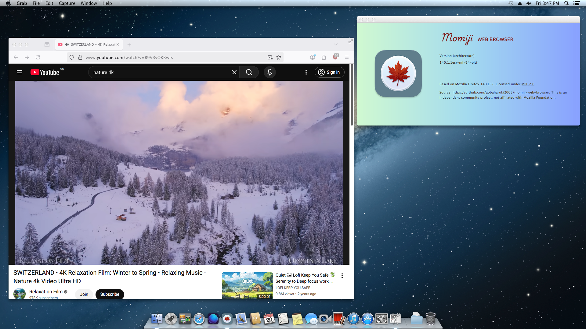

 
  
  

# Momiji Web Browser - macOS Legacy (10.7-10.14) support

---
> [!IMPORTANT]
> - Hardware graphics acceleration is available but maybe buggy on some platforms  (on my Ivy Bridge machine, fonts look partially broken in case of macOS 10.7 and 10.8). In case of buggy experience, follow [this guide](https://support.mozilla.org/en-US/kb/performance-settings) to turn off hardware acceleration for better Web rendering.
>     - Especially, in pre-2010 era machines, Momiji is reported with `SIGILL` crash in thread `Renderer`. If you encounter this, try running Momiji in safe-mode first using Terminal: `/path/to/Momiji.app/Contents/MacOS/momiji --safe-mode` (replace `/path/to/Momiji.app` with your actual Momiji path), then turn off hardware acceleration using the above guide). 
>      - After that, perform a normal launch to see whether it works. If not, please file a bug in the Issue subpage. For more detail about this caveats, check out for this [issue #13 reference](https://github.com/aobaharuki2005/momiji-web-browser/issues/13#issuecomment-4412459833)
> - Full screen sharing (in Google Meet, Microsoft Teams, etc.) and Translations is unavailable on macOS 10.7
> - Discord voice, video calls and its Go Live streams are unsupported as they require at least Firefox 142 to work on since 2026-Mar-02, while Momiji is currently being based on Firefox 140 ESR baseline.
> - DRM-encrypted content (e.g. Spotify, Netflix) is unable to play by default, due to unsupported WideVine plugin. If you need this, bring it back by leveraging Momiji Downloader created by Wowfunhappy to install Momiji in this [link](https://mavericksforever.com/).

> [!NOTE]
> - According to [Firefox Release Calendar](https://whattrainisitnow.com/calendar/), the end-of-life date for Firefox 140 ESR **has been extended further 2 weeks till 2026-Sep-29,** marking the 17th release of the equivalent baseline.
> - Another thing to notice is that Mozilla **have boosted their releasing schedule up to 2x faster than before**, reducing durations between two consecutive releases down to only 2 weeks. I think that Mozilla has been increasingly leveraging AI recently must be playing a huge role in this. However as I'm still undergoing my undergraduate program for the last year, together with the fact I am not financially eligible for such paid plans, it's not worth expecting me to follow such speedy release schedules.
---

## About Momiji

Firefox browser backported and maintained for macOS 10.7-10.14.

This project is the fork, the successor and inheritance of [firefox-dynasty](https://github.com/i3roly/firefox-dynasty) project - which (together with the owner), unfortunately, has been taken down due to GitHub violation of Term of Use. You can find more detail about the incident in this [MacRumors post](https://forums.macrumors.com/threads/firefox-dynasty-firefox-for-os-x-10-8-also-web-app-templates.2446475/post-34441749).

Momiji（紅葉、もみじ）means "red leaves of autumn" in Japanese. I came up with the idea because the Japanese "mo" sound resembles the "mo" sound in the original "Mozilla Foundation" trademark. Additionally, red leaves are also told to be able to make people remind of good old memories, so using such a name for this backported Firefox distribution, to my thought, is a good idea (maybe).

## Features:
- Allow browsing modern Web and using up-to-date Web services securely (with fully applied security patches) on macOS version unsupported by Apple and Mozilla, with almost fully working functions (for more detail about poorly supported Web functions, especially if you are using macOS 10.7, please check out for "Important" notice)
- Disable unnecessary and unsupported components: Crash Reporter, Tests, Debug, Dark Matter Detector (DMD), Geckodriver and Profiling.

## Modifications

See [CHANGES.md](CHANGES.md) for complete list. (Completed on 2026-Apr-01).

## License and Trademarks

Momiji is licensed under the [Mozilla Public License 2.0](LICENSE)

Firefox® is a registered trademark of the Mozilla Foundation.
This project is NOT AFFILIATED WITH, ENDORSED BY, OR SPONSORED by Mozilla Foundation.

## Disclaimer
This is an independent community open-source project. Use at your own risk. No warranty provided.

## Source Code
Full source code is available in this repository, as required by the Mozilla Public License 2.0.

Modified files are documented in [CHANGES.md](CHANGES.md).

## Downloads
Check out for my releases (binary distribution and source code archive) in this [Releases](https://github.com/aobaharuki2005/firefox-dynasty-RELIFE/releases) page.

## Building
For build guide, please checkout for [BUILDING.md](BUILDING.md)

## Screenshot

## Credits

If I've forgotten to put your name here, please let me know and I'll add it.

[Mozilla Developers](https://github.com/mozilla-firefox) - Firefox browser base

[i3roly](https://github.com/i3roly) - Original ideas, patches and owners of firefox-dynasty project

[Wowfunhappy](https://github.com/Wowfunhappy) - Maintainers of the firefox-dynasty fork of the original project. Without his invaluable forked source, I wouldn't have been able to rebuilt, reverse engineered and revive the project from scratch like today.

[LibreWolf](https://codeberg.org/librewolf/source) - debloating and privacy patches

[GNU IceCat](https://cgit.git.savannah.gnu.org/cgit/gnuzilla.git) - debloating patches

## Contact

In case of any questions, please contact me via email: tranbaohnth@outlook.com.vn

# Original repository readme

[Firefox](https://firefox.com/) is a fast, reliable and private web browser from the non-profit [Mozilla organization](https://mozilla.org/).

## Contributing

To learn how to contribute to Firefox read the [Firefox Contributors' Quick Reference document](https://firefox-source-docs.mozilla.org/contributing/contribution_quickref.html).

We use [bugzilla.mozilla.org](https://bugzilla.mozilla.org/) as our issue tracker, please file bugs there.

## Resources

* [Firefox Source Docs](https://firefox-source-docs.mozilla.org/) is our primary documentation repository
* Nightly development builds can be downloaded from [Firefox Nightly page](https://www.mozilla.org/firefox/channel/desktop/#nightly)

If you have a question about developing Firefox, and can't find the solution
on [Firefox Source Docs](https://firefox-source-docs.mozilla.org/), you can try asking your question on Matrix at
chat.mozilla.org in the [Introduction channel](https://chat.mozilla.org/#/room/#introduction:mozilla.org).
